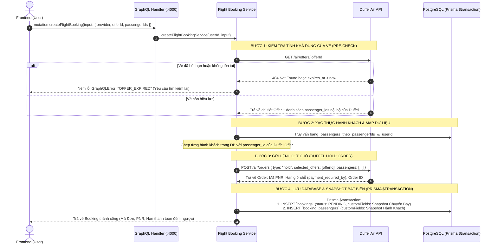

# ✈️ Phase 1: Flight Search & Hold Booking Integration

Tài liệu thiết kế kiến trúc chi tiết, quy trình xác thực Offer, quy tắc ánh xạ dữ liệu (Data Mapping) và luồng thực thi code cho tính năng **Giữ Chỗ Chuyến Bay (Hold Order & Immutable Snapshot)**.

---

## 📌 1. Tổng Quan Kiến Trúc Nghiệp Vụ Task 2

Khi người dùng chọn 1 vé (`offerId`) từ kết quả tìm kiếm, quy trình giữ chỗ diễn ra theo **4 bước tuần tự** để đảm bảo tính toàn vẹn dữ liệu, kiểm tra tính khả dụng của vé và lưu trữ Snapshot bất biến:



---

## 📥 2. Đặc Tả GraphQL Schema (Input & Output)

### 2.1. Input: `CreateFlightBookingInput`

```graphql
input CreateFlightBookingInput {
  provider: String # Mặc định: "duffel"
  offerId: String! # Mã Offer từ bước tìm kiếm (VD: "off_0000B9kXbfpT8Bd07oqnH0")
  passengerIds: [ID!]! # Danh sách UUID hành khách được chọn từ sổ danh bạ
}
```

### 2.2. Output: `FlightBookingResult`

```graphql
type FlightBookingResult {
  bookingId: ID!
  provider: String!
  providerBookingId: String!
  bookingReference: String! # Mã PNR của hãng bay (VD: "VN789X")
  paymentRequiredBy: String # Thời hạn chót giữ chỗ (ISO DateTime)
  status: BookingStatus! # PENDING
  totalAmount: String!
  currency: String!
  carrier: FlightCarrier!
  slices: [FlightSlice!]!
  passengers: [BookingPassengerResult!]!
  createdAt: String!
}

type BookingPassengerResult {
  bookingPassengerId: ID!
  passengerId: ID!
  firstName: String!
  lastName: String!
  type: PassengerType!
  passportNumber: String
}
```

---

## 🔄 3. Chi Tiết Các Bước Xử Lý & Mapping Dữ Liệu

---

### 🔹 BƯỚC 1: Kiểm Tra Hiệu Lực Của Vé (`GET /air/offers/:offerId`)

Trước khi tạo lệnh giữ chỗ, backend bắt buộc phải gọi Duffel để xác minh:

1. **Kiểm tra thời gian hết hạn (`expires_at`):**
   - Nếu `new Date(offer.expires_at) < new Date()`, ném lỗi:
     ```json
     {
       "message": "Vé này đã hết hạn giữ giá của hãng. Vui lòng tìm kiếm lại!",
       "code": "OFFER_EXPIRED"
     }
     ```
2. **Lấy danh sách `passenger_ids` của Duffel:**
   - Trong Duffel Offer, mỗi vị trí khách có 1 `id` tạm thời (VD: `pas_00001`, `pas_00002`). Ta cần mảng ID này để ghép đúng 1-1 với hành khách của hệ thống ở Bước 2.
3. **Kiểm tra số lượng khách:**
   - Số lượng `passengerIds` gửi lên phải bằng chính xác số lượng khách trong Offer (`offer.passengers.length`).

---

### 🔹 BƯỚC 2: Mapping Dữ Liệu Hành Khách Gửi Sang Duffel

Duffel yêu cầu định dạng hành khách chuẩn quốc tế:

| Trường Database (`passengers`) | Trường gửi sang Duffel (`POST /air/orders`)  | Quy tắc chuyển đổi                                             |
| :----------------------------- | :------------------------------------------- | :------------------------------------------------------------- |
| `offer.passengers[i].id`       | `id`                                         | Bắt buộc lấy ID từ Offer ở Bước 1 (`pas_xxx`)                  |
| `gender`                       | `title`                                      | `'male'` $\rightarrow$ `'mr'`, `'female'` $\rightarrow$ `'ms'` |
| `gender`                       | `gender`                                     | `'male'` $\rightarrow$ `'m'`, `'female'` $\rightarrow$ `'f'`   |
| `firstName`                    | `given_name`                                 | Viết hoa chữ cái đầu, không dấu (hoặc giữ nguyên)              |
| `lastName`                     | `family_name`                                | Họ người bay                                                   |
| `dateOfBirth`                  | `born_on`                                    | Định dạng `YYYY-MM-DD`                                         |
| `user.email` / `phone`         | `email`, `phone_number`                      | Email và số điện thoại liên hệ                                 |
| `passportNumber`               | `identity_documents[0].unique_identifier`    | Số hộ chiếu                                                    |
| `passportCountry`              | `identity_documents[0].issuing_country_code` | Quốc gia cấp hộ chiếu (`VN`)                                   |
| `passportExpiryDate`           | `identity_documents[0].expires_on`           | Ngày hết hạn `YYYY-MM-DD`                                      |

---

### 🔹 BƯỚC 3: Tạo Đơn Giữ Chỗ Duffel (`POST /air/orders`)

- **Endpoint:** `POST https://api.duffel.com/air/orders`
- **Payload gửi đi:**
  ```json
  {
    "data": {
      "type": "hold",
      "selected_offers": ["off_0000B9kXbfpT8Bd07oqnH0"],
      "passengers": [
        {
          "id": "pas_0000B9kXbfpT8Bd07oqnH1",
          "title": "mr",
          "given_name": "An",
          "family_name": "Nguyen",
          "gender": "m",
          "born_on": "1992-03-14",
          "email": "an.nguyen@example.com",
          "phone_number": "+84901234567",
          "identity_documents": [
            {
              "type": "passport",
              "unique_identifier": "B1234567",
              "issuing_country_code": "VN",
              "expires_on": "2030-05-20"
            }
          ]
        }
      ]
    }
  }
  ```
- **Dữ liệu Duffel trả về:**
  - `id`: `ord_0000B9kY...` (Mã đơn hàng Duffel)
  - `booking_reference`: `VN998XYZ` (Mã **PNR** chính thức của hãng bay)
  - `payment_required_by`: `2026-08-27T10:00:00Z` (Hạn chót thanh toán giữ chỗ)
  - `total_amount`: `"3450000"`
  - `total_currency`: `"VND"`

---

### 🔹 BƯỚC 4: Lưu Trữ CSDL & Snapshot Bất Biến (Prisma $transaction)

Tất cả các lệnh insert đều được thực thi trong 1 **Prisma Transaction** duy nhất:

#### 1. Bảng `bookings`:

- **Các cột chuẩn (Standard Columns):**
  - `bookingId`: UUID
  - `userId`: UUID (Từ context xác thực)
  - `provider`: `"duffel"`
  - `providerBookingId`: `order.id` (`"ord_0000B9kY..."`)
  - `status`: `PENDING`
  - `totalAmount`: `order.total_amount` (`3450000`)
  - `currency`: `order.total_currency` (`"VND"`)
- **Cột Snapshot `customFields` (JSONB):**
  ```json
  {
    "bookingReference": "VN998XYZ",
    "paymentRequiredBy": "2026-08-27T10:00:00.000Z",
    "duffelOfferId": "off_0000B9kXbfpT8Bd07oqnH0",
    "cabinClass": "economy",
    "carrier": {
      "iataCode": "VN",
      "name": "Vietnam Airlines",
      "logoUrl": "https://assets.duffel.com/img/airlines/for-light-background/full-color-logo/VN.svg"
    },
    "slices": [
      {
        "origin": {
          "iataCode": "SGN",
          "name": "Tan Son Nhat International Airport",
          "cityName": "Ho Chi Minh City"
        },
        "destination": {
          "iataCode": "DAD",
          "name": "Da Nang International Airport",
          "cityName": "Da Nang"
        },
        "departureDate": "2026-10-10",
        "duration": "PT1H20M",
        "segments": [
          {
            "flightNumber": "VN124",
            "departureAt": "2026-10-10T08:00:00",
            "arrivalAt": "2026-10-10T09:20:00",
            "aircraft": "Airbus A321",
            "carrier": { "iataCode": "VN", "name": "Vietnam Airlines" }
          }
        ]
      }
    ],
    "conditions": {
      "refundBeforeDeparture": false,
      "changeBeforeDeparture": true
    }
  }
  ```

#### 2. Bảng `booking_passengers`:

- **Các cột chuẩn:**
  - `bookingPassengerId`: UUID
  - `bookingId`: `booking.bookingId`
  - `passengerId`: `passenger.passengerId`
- **Cột Snapshot `customFields` (JSONB):**
  ```json
  {
    "duffelPassengerId": "pas_0000B9kXbfpT8Bd07oqnH1",
    "type": "ADULT",
    "title": "mr",
    "firstName": "An",
    "lastName": "Nguyen",
    "dateOfBirth": "1992-03-14",
    "gender": "male",
    "nationality": "VN",
    "passportNumber": "B1234567",
    "passportCountry": "VN",
    "passportExpiryDate": "2030-05-20"
  }
  ```

---

## 🗂️ 4. Cấu Trúc File Triển Khai Trong Codebase

```
src/
├── types/
│   └── booking.ts                    # Type definitions cho Hold Order & Booking Snapshot
│
├── handlers/
│   └── flight/
│       ├── search.ts                 # Query searchFlights (Đã hoàn thành)
│       └── holdOrder.ts              # 👈 Mutation createFlightBooking
│
└── servers/
    ├── flight/
    │   ├── search.ts                 # searchFlightsViaProvider (Đã hoàn thành)
    │   └── holdOrder.ts              # 👈 createHoldOrderViaProvider (Kiểm tra DB, Transaction)
    │
    └── duffel/
        ├── search.ts                 # searchFlights (Đã hoàn thành)
        ├── holdOrder.ts              # 👈 getOfferDetails & executeHoldOrder
        └── index.ts                  # DuffelFlightProvider (Gắn thêm method createHoldOrder)
```

---

## 🛡️ 5. Các Quy Tắc Bảo Mật & Rủi Ro Cần Kiểm Soát (Security & Edge Cases)

1. **Kiểm tra quyền sở hữu hành khách (IDOR Protection):**
   - Người dùng chỉ được phép truyền `passengerIds` thuộc về tài khoản của chính họ (`where: { passengerId: { in: passengerIds }, userId: currentUser.userId }`).
2. **Xử lý lệch giá (Price Discrepancy / Slippage):**
   - Nếu Duffel báo giá vé thay đổi giữa lúc tìm kiếm và lúc giữ chỗ, Duffel sẽ từ chối tạo Order $\rightarrow$ Backend bắt lỗi và thông báo giá vé đã cập nhật.
3. **Đếm ngược thời gian giữ vé (Countdown Timer):**
   - Frontend sử dụng trường `paymentRequiredBy` để hiển thị thời gian còn lại trước khi vé bị hủy tự động trên hệ thống hãng.
