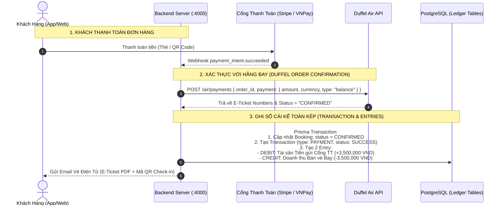

# 🚀 Phase 2: Advanced Flight Features, Itineraries & Payments

Tài liệu thiết kế kiến trúc, đặc tả kỹ thuật và lộ trình triển khai chi tiết cho **Phase 2** (Tính năng tìm kiếm nâng cao, Dịch vụ bổ trợ & Thanh toán sổ cái kép).

---

## 📌 1. Mục Tiêu & Phạm Vi (Phase 2 Scope)

Sau khi hoàn thành **Phase 1 (Tìm kiếm cơ bản & Giữ chỗ PENDING)**, **Phase 2** tập trung vào việc nâng cấp trải nghiệm người dùng thành một **OTA (Online Travel Agency) hoàn chỉnh**:

```
┌────────────────────────────────────────────────────────────────────────┐
│ PHẠM VI PHASE 2 (ADVANCED FLIGHTS, ANCILLARIES & PAYMENTS)             │
│  1. Nâng cấp Tìm kiếm Hành trình (Itineraries View: view=itineraries). │
│  2. Phân tầng hạng vé (Fare Families: Economy Lite, Flex, Business).   │
│  3. Sơ đồ chọn chỗ ngồi tương tác thời gian thực (Interactive Seat Map)│
│  4. Mua thêm Dịch vụ bổ trợ (Ancillaries: Hành lý ký gửi, Suất ăn).   │
│  5. Tích hợp Cổng thanh toán (Stripe / VNPay / MoMo).                  │
│  6. Xác thực thanh toán Duffel (POST /air/payments) & Xuất vé E-Ticket │
│  7. Ghi sổ cái kế toán kép (Double-Entry Ledger: Ledger Accounts).     │
│  8. Hệ thống Webhook & Saga Pattern xử lý bồi hoàn / Hủy vé.           │
└────────────────────────────────────────────────────────────────────────┘
```

---

## 🗺️ 2. So Sánh Kiến Trúc Tìm Kiếm (Phase 1 vs Phase 2)

```mermaid
graph TD
    subgraph "Phase 1: Offers View (view=offers)"
        A1["Tìm kiếm SGN -> HAN"] --> B1["Duffel trả về Gói vé trọn gói ghép sẵn"]
        B1 --> C1["Client chọn 1 Vé trọn gói (Đã cố định giá & chuyến đi/về)"]
    end

    subgraph "Phase 2: Itineraries View (view=itineraries)"
        A2["Tìm kiếm SGN <-> HAN (Khứ hồi)"] --> B2["Bước 1: Chọn Chuyến bay đi (Outbound)"]
        B2 --> C2["Bước 2: Chọn Hạng vé (Lite / Classic / Flex / Business)"]
        C2 --> D2["Bước 3: Chọn Chuyến bay về (Inbound) & Hạng vé về"]
        D2 --> E2["Bước 4: Chọn Ghế ngồi (Seat Map) & Mua Hành lý"]
        E2 --> F2["Bước 5: Thanh toán & Xuất vé điện tử"]
    end
```



---

## 🔍 3. Đặc Tả Kỹ Thuật: `view=itineraries` & Hạng Vé Phân Tầng

### 3.1. Endpoint & Tham số

- **Endpoint:** `POST https://api.duffel.com/air/offer_requests?return_offers=true&view=itineraries`
- **Mục đích:** Gom nhóm theo từng Chuyến bay (Itinerary), bên trong chứa danh sách các mức giá (`available_fares`).

### 3.2. Cấu trúc Response `view=itineraries`:

```json
{
  "data": {
    "id": "orq_0000Avs...",
    "itineraries": [
      {
        "id": "iti_00001",
        "slice": {
          "origin": { "iata_code": "SGN", "name": "Tân Sơn Nhất" },
          "destination": { "iata_code": "HAN", "name": "Nội Bài" },
          "departure_date": "2026-09-25",
          "segments": [
            {
              "operating_carrier": { "iata_code": "VN", "name": "Vietnam Airlines" },
              "operating_carrier_flight_number": "216",
              "departing_at": "2026-09-25T08:00:00",
              "arriving_at": "2026-09-25T10:15:00"
            }
          ]
        },
        "cheapest_total_amount": "1500000",
        "cheapest_total_currency": "VND",
        "available_fares": [
          {
            "offer_id": "off_001_lite",
            "cabin_class": "economy",
            "fare_name": "Economy Super Lite",
            "total_amount": "1500000",
            "conditions": {
              "change_before_departure": { "allowed": false },
              "refund_before_departure": { "allowed": false }
            },
            "baggage": { "carry_on": "12kg", "checked": "0kg" }
          },
          {
            "offer_id": "off_002_flex",
            "cabin_class": "economy",
            "fare_name": "Economy Flex",
            "total_amount": "2350000",
            "conditions": {
              "change_before_departure": { "allowed": true, "penalty_amount": "0" },
              "refund_before_departure": { "allowed": true, "penalty_amount": "500000" }
            },
            "baggage": { "carry_on": "12kg", "checked": "23kg" }
          }
        ]
      }
    ]
  }
}
```

---

## 💺 4. Dịch Vụ Bổ Trợ (Ancillaries & Seat Selection)

### 4.1. Sơ đồ chọn ghế ngồi (Interactive Seat Map)

- **Endpoint:** `GET https://api.duffel.com/air/seat_maps?offer_id=off_xxx`
- **Dữ liệu trả về:**
  - Sơ đồ máy bay (Cabin rows, columns: A, B, C, D, E, F).
  - Vị trí lối đi (Aisle), cửa sổ (Window), cửa thoát hiểm (Exit row có chỗ để chân rộng - Extra Legroom).
  - Trạng thái ghế: `available` / `occupied` và giá tiền chọn ghế (`service_id`, `total_amount`).

### 4.2. Mua thêm Hành lý ký gửi (Extra Baggage)

- Khi gọi `GET /air/offers/:id`, Duffel trả về danh sách `available_services`:
  ```json
  {
    "id": "ase_00001",
    "type": "baggage",
    "maximum_weight_kg": 23,
    "total_amount": "350000",
    "total_currency": "VND"
  }
  ```
- Khi khách bấm chọn mua thêm hành lý, thêm `services: [{ id: "ase_00001", quantity: 1 }]` vào payload `POST /air/orders`.

---

## 💳 5. Thanh Toán & Ghi Sổ Cái Kế Toán Kép (Double-Entry Ledger)

### 5.1. Luồng Thanh Toán & Xuất Vé



---

## 📋 6. Danh Sách Công Việc Cho Phase 2 (Task Breakdown)

| Mã Task   | Hạng mục công việc                  | Mô tả kỹ thuật                                                                                 |
| :-------- | :---------------------------------- | :--------------------------------------------------------------------------------------------- |
| **P2-01** | `view=itineraries` Search Service   | Thêm tham số `view` vào Duffel search và xây dựng transformer cho Itineraries & Branded Fares. |
| **P2-02** | Seat Map Service (`/air/seat_maps`) | Service lấy layout ghế, giá ghế theo khoang, GraphQL Query `flightSeatMap`.                    |
| **P2-03** | Baggage & Ancillaries Service       | Tích hợp mua hành lý ký gửi, suất ăn, bảo hiểm chuyến bay.                                     |
| **P2-04** | Payment Gateway Integration         | Tích hợp Stripe / VNPay / MoMo và bảo mật Webhook HMAC Signature.                              |
| **P2-05** | Duffel Order Settlement             | Gửi yêu cầu xuất vé `POST /air/payments` với Duffel Balance.                                   |
| **P2-06** | Double-Entry Accounting Ledger      | Ghi sổ nợ/có tự động vào bảng `transactions` & `transaction_entries`.                          |
| **P2-07** | Automated E-Ticket Email            | Render file PDF vé điện tử kèm mã QR và gửi email qua Resend / SendGrid.                       |

---

> [!NOTE]
> Tài liệu này được tạo nhằm lưu trữ đặc tả cho Phase 2. Toàn bộ kiến trúc Phase 1 hiện tại đã được thiết kế sẵn sàng và tương thích 100% để nâng cấp lên Phase 2 mà không cần phá vỡ cấu trúc database hay API hiện tại.
